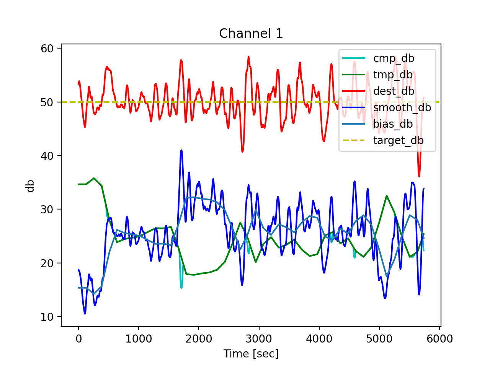

# これは何
音・信号処理に関する小ツール群（予定）

## [wlev.py](wlev.py)

- wavの音量を自動で調節するスクリプト
  - 多チャンネル wav 対応
  - 音量を指定するには `-d` か `--db`
    - デフォルト値は 50 db
- 音量を一定にするだけでは強弱の情報を失い違和感が生まれるので工夫した
  - 音量の直流バイアスを調節の基準にとる
  - wav が壊れないようにマキシマイズするのみに留めている
    - 将来的にコンプレッサーとその逆を追加して距離の変化を完全に分からなくしたい
    - 唐突な奇声・絶叫によるダメージも軽減できるはず
- "AUTO LEVEL"という TASCAM の録音機に付いている入力レベルを調節する機能を気に入ったのでバッチ処理で再現した
  - リアルタイム処理専用のツールばかりだからバッチ処理用ツールは作り甲斐がある
- 名前は "wav auto level" から
- 歩きまわる人間のボリュームを調節し続ける作業から解放されるのはかなり便利でとても役に立つ

## [wav_conversion.py](wav_conversion.py)

- SciPyが読み込めないwavファイルをSciPyが読み込めるように変換するツール
- [wavファイルの周波数信号をプロットさせるプログラムでエラーが消えない](https://teratail.com/questions/319432) のエラー `WavFileWarning: Chunk (non-data) not understood, skipping it.` を解決する
- SciPyの実装を見てないからわからないが一応解決する
 - このエラーはおそらく[BWF](https://ja.wikipedia.org/wiki/Broadcast_Wave_Format)フォーマットが原因
   - BWFフォーマットに記録された時間情報と実際のデータの長さのズレによる（多分）
   - このツールによりBWFのメタデータは失われる

## [wmono.py](wmono.py)

- wavファイルをモノラルにするツール
  - 抽出するチャンネルを指定するには `-c` か `--ch`
    - デフォルトチャンネルは 1

## [wcut.py](wcut.py)

- wavファイルを切り出すツール
- オプション引数で切り出し方を指定できる

## [envelope.py](envelope.py)

- ヒルベルト変換で得た包絡線に基づいて簡単にwavを切り出すやつ
- 閾値より大きい音か小さい音を抽出する
  - オプション引数`--noEnergy`で切り替える
- 背景ノイズ除去に使うノイズプロファイルを作るのに便利
- 入力サイズに注意が必要
  - 入力ファイルが1分程度の場合は一瞬で終わる
  - 入力ファイルが1時間程度の場合は10分経っても終わらず，実用に耐えない
    - メモリを割と消費する
    - 1分で終わらない
    - 深層学習の方が速い（正確に比べたわけではない）
- 音量・時間を表示できるようにしたい
- ステレオファイルに対する挙動は未確認

## [_w.py](_w.py)

- wav音声の先頭に無音を挿入するツール
- オプション引数とかで後尾に挿入できるようにしたい
